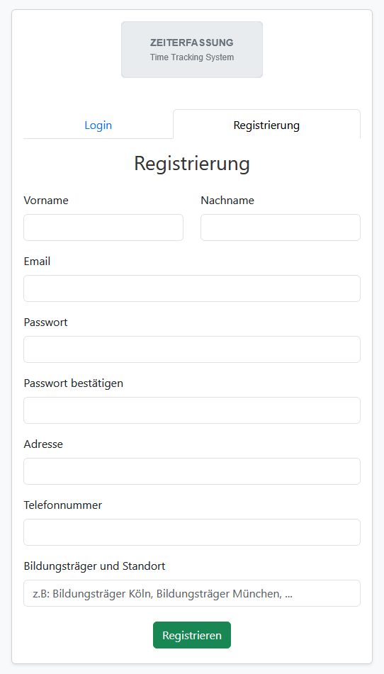
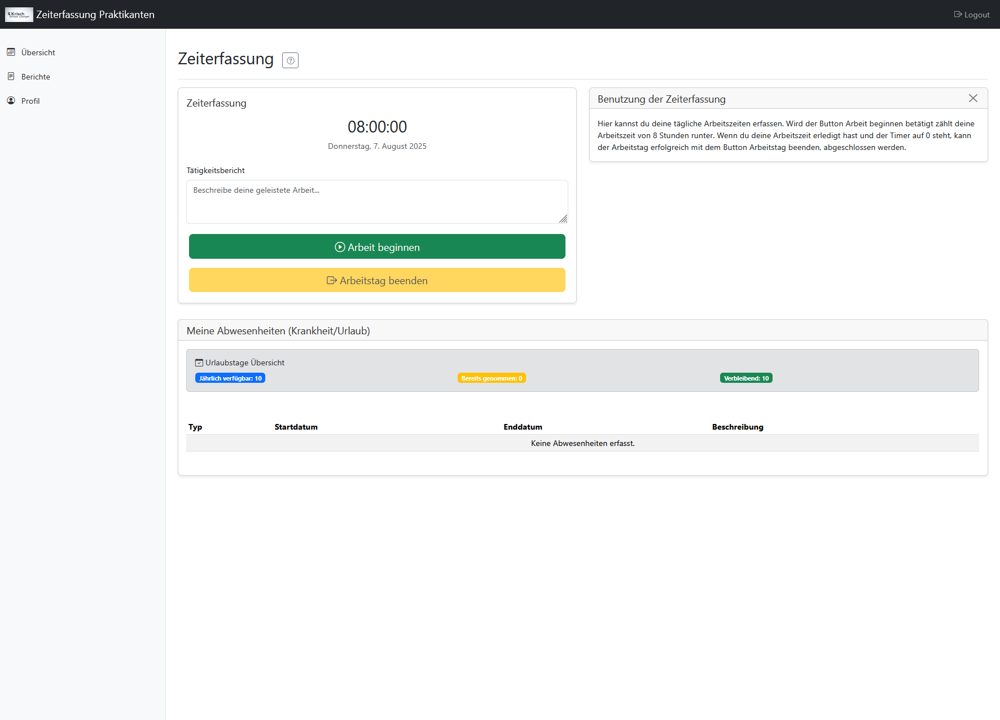
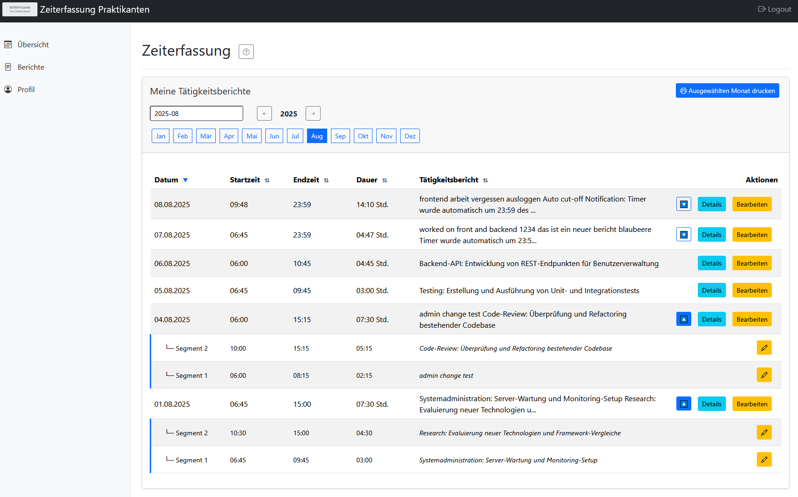
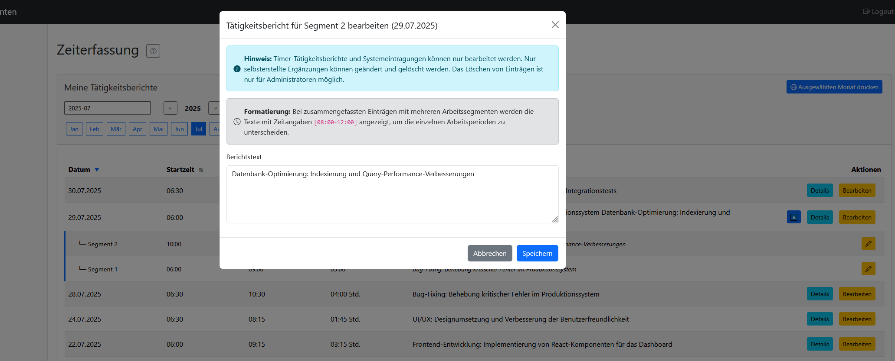
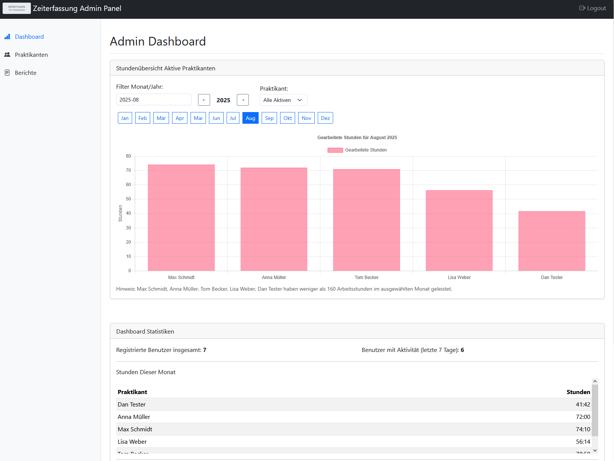
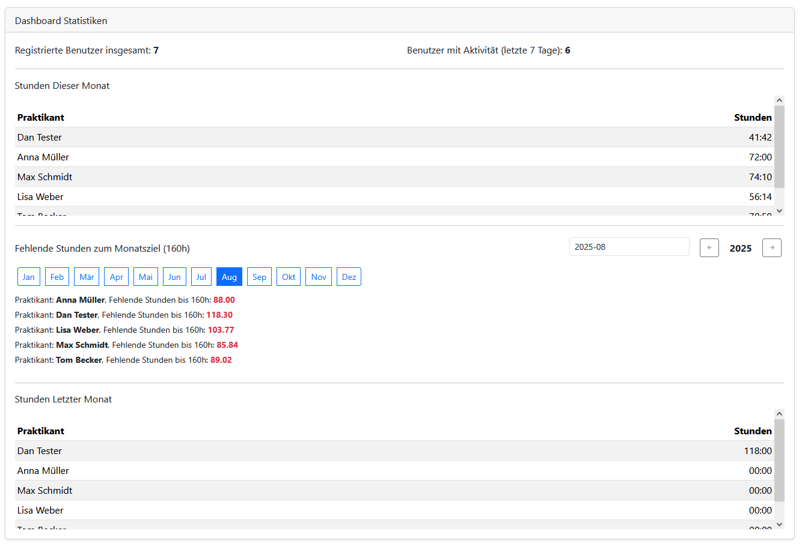
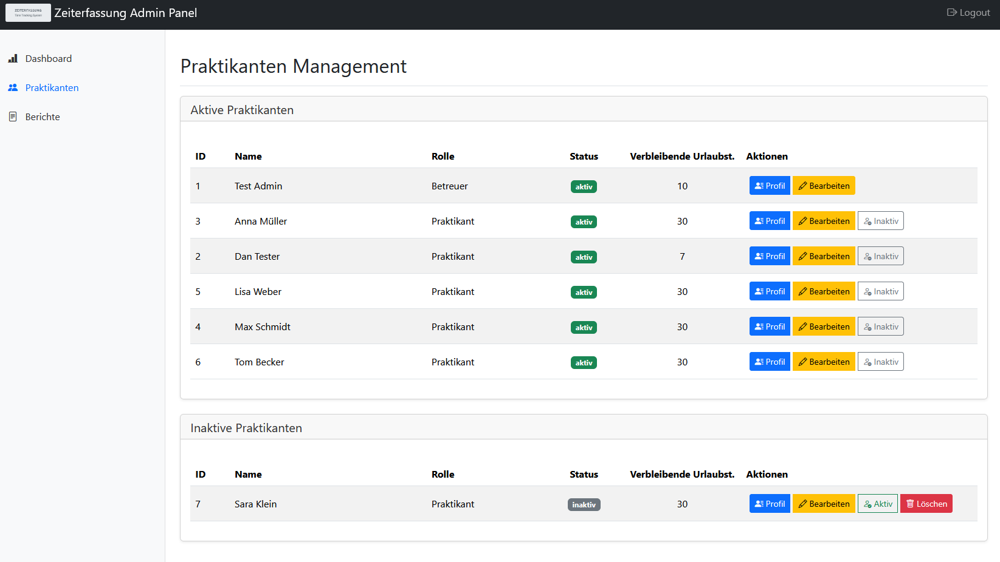
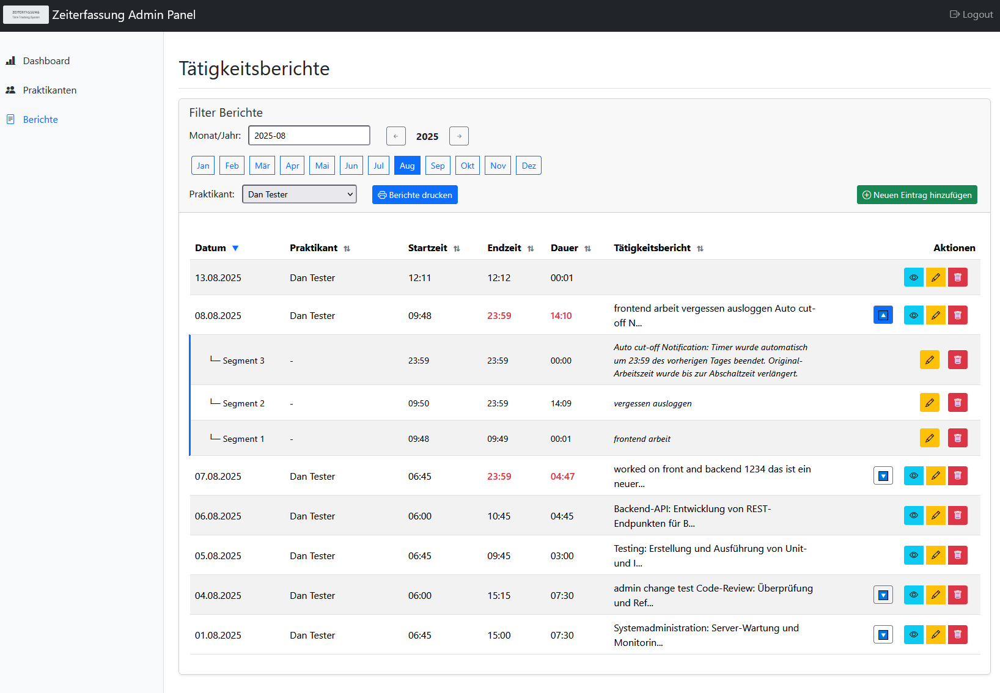

# Zeiterfassungssystem Für Praktikanten und/oder Mitarbeiter

Ein deutsches Zeiterfassungs-Webanwendung für das Praktikantenmanagement in Unternehmen. Diese Full-Stack-Anwendung bietet umfassende Zeiterfassung, Abwesenheitsverwaltung und Berichtsfunktionen.

[](https://creativecommons.org/licenses/by-nc/4.0/)
[](https://www.docker.com/)
[](https://nodejs.org/)
[](https://www.mysql.com/)

## Screenshots

### Login & Registrierung
<div align="center">
  
  
</div>

### Praktikanten Dashboard
<div align="center">
  
  
</div>
<div align="center">
  
  
</div>

### Admin Dashboard
<div align="center">
  
  
</div>
<div align="center">
  
  
</div>

## Funktionen

- **Zeiterfassung**: Echtzeit-Countdown-Timer mit automatischer Persistierung
- **Benutzerverwaltung**: Rollenbasierte Zugriffskontrolle (Admin/Praktikant)
- **Abwesenheitsverwaltung**: Urlaubs- und Krankmeldungen
- **Berichte**: Detaillierte Zeitberichte erstellen und exportieren
- **Mehrsprachigkeit**: Deutsche Lokalisierung durchgängig
- **Responsive Design**: Bootstrap 5.3.3 basierte Benutzeroberfläche

## Technologie-Stack

- **Backend**: Node.js mit Express.js
- **Datenbank**: MySQL 8.0
- **Frontend**: Vanilla JavaScript, Bootstrap 5.3.3
- **Authentifizierung**: Session-basiert mit bcrypt Passwort-Hashing
- **Deployment**: Docker & Docker Compose bereit

## Schnellstart

### Voraussetzungen

- Node.js 22+ 
- MySQL 8.0+ oder Docker
- npm oder yarn

### Installation

#### Option 1: Docker Setup (Empfohlen)

1. **Repository klonen**
   ```bash
   git clone https://github.com/HcKaos/zeiterfassungssystem.git
   cd zeiterfassungssystem
   ```

2. **Umgebung konfigurieren**
   ```bash
   cp .env.example .env
   # .env mit Ihren Datenbank-Zugangsdaten bearbeiten
   ```

3. **Mit Docker starten**
   ```bash
   docker-compose up -d
   ```
   
   Docker übernimmt automatisch:
   - Installation der Node.js Abhängigkeiten
   - Datenbank-Setup und Schema-Erstellung
   - Erstellung des initialen Admin-Benutzers

#### Option 2: Manuelle Installation

1. **Voraussetzung**: MySQL 8.0+ läuft lokal z.B. XAMPP

2. **Abhängigkeiten installieren**
   ```bash
   npm install
   ```

3. **Umgebung konfigurieren und starten**
   ```bash
   cp .env.example .env
   # .env mit lokalen MySQL-Zugangsdaten bearbeiten
   npm start
   ```

5. **Anwendung aufrufen**
   - Web-Anwendung: http://localhost:3000
   - phpMyAdmin: http://localhost:3002 (nur Docker)

## Konfiguration

### Umgebungsvariablen

Siehe `.env.example` für alle erforderlichen Umgebungsvariablen:

- `DB_HOST`, `DB_USER`, `DB_PASSWORD`, `DB_NAME`: Datenbankverbindung
- `ADMIN_EMAIL`, `ADMIN_PASSWORD`: Initiale Admin-Benutzer-Zugangsdaten
- `SESSION_SECRET`: Sicheres Session-Secret für Produktion
- `PORT`: Anwendungsport (Standard: 3000)

### Datenbank-Setup

Die Anwendung erstellt automatisch das Datenbankschema und den initialen Admin-Benutzer beim ersten Start. Admin-Zugangsdaten über Umgebungsvariablen konfigurieren.

---

# Time Tracking System

A German time tracking web application designed for intern management in companies. This full-stack application provides comprehensive time tracking, absence management, and reporting features.

## Features

- **Time Tracking**: Real-time countdown timer with automatic persistence
- **User Management**: Role-based access control (Admin/Intern)
- **Absence Management**: Vacation and sick leave tracking
- **Reporting**: Generate detailed time reports and export functionality
- **Multi-language Support**: German localization throughout
- **Responsive Design**: Bootstrap 5.3.3 based UI

## Technology Stack

- **Backend**: Node.js with Express.js
- **Database**: MySQL 8.0
- **Frontend**: Vanilla JavaScript, Bootstrap 5.3.3
- **Authentication**: Session-based with bcrypt password hashing
- **Deployment**: Docker & Docker Compose ready

## Quick Start

### Prerequisites

- Node.js 22+ 
- MySQL 8.0+ or Docker
- npm or yarn

### Installation

#### Option 1: Docker Setup (Recommended)

1. **Clone the repository**
   ```bash
   git clone https://github.com/HcKaos/zeiterfassungssystem.git
cd zeiterfassungssystem
   cd zeiterfassungssystem
   ```

2. **Configure environment**
   ```bash
   cp .env.example .env
   # Edit .env with your database credentials
   ```

3. **Start with Docker**
   ```bash
   docker-compose up -d
   ```
   
   Docker automatically handles:
   - Node.js dependency installation
   - Database setup and schema creation
   - Initial admin user creation

#### Option 2: Manual Setup

1. **Prerequisites**: Ensure MySQL 8.0+ is running locally

2. **Install dependencies**
   ```bash
   npm install
   ```

3. **Configure environment and start**
   ```bash
   cp .env.example .env
   # Edit .env with your local MySQL credentials
   npm start
   ```

5. **Access the application**
   - Web Application: http://localhost:3000
   - phpMyAdmin: http://localhost:3002 (Docker only)

## Configuration

### Environment Variables

See `.env.example` for all required environment variables:

- `DB_HOST`, `DB_USER`, `DB_PASSWORD`, `DB_NAME`: Database connection
- `ADMIN_EMAIL`, `ADMIN_PASSWORD`: Initial admin user credentials
- `SESSION_SECRET`: Secure session secret for production
- `PORT`: Application port (default: 3000)

### Database Setup

The application automatically creates the database schema and initial admin user on first run. Configure admin credentials via environment variables.

## API Endpoints

### Authentication
- `POST /api/auth/login` - User login
- `POST /api/auth/register` - User registration
- `POST /api/auth/logout` - User logout

### Time Tracking
- `POST /api/arbeitszeiten/start` - Start time tracking
- `POST /api/arbeitszeiten/stop` - Stop time tracking
- `GET /api/arbeitszeiten/status` - Get current timer status

### User Management (Admin)
- `GET /api/users` - List all users
- `PUT /api/users/:id` - Update user
- `DELETE /api/users/:id` - Delete user

### Reports
- `GET /api/reports/user/:id` - Generate user report
- `GET /api/reports/monthly/:year/:month` - Monthly report

## Development

### Project Structure
```
├── server.js              # Main Express application
├── config/
│   ├── database.js         # Database configuration
│   └── setup_prod_db.js   # Database initialization
├── Frontend/
│   ├── login.html         # Login page
│   ├── dashboard.html     # User dashboard
│   ├── admindashboard.html # Admin dashboard
│   ├── zeiterfassung.js   # Main frontend logic
│   ├── admin.js           # Admin panel logic
│   └── styles.css         # Custom styles
├── docker-compose.yml     # Docker composition
└── Dockerfile            # Container definition
```

### Database Schema

- **Praktikanten**: User accounts and profiles
- **Arbeitszeiten**: Time tracking records
- **Abwesenheiten**: Absence requests and approvals

### Security Features

- SQL injection prevention via prepared statements
- Password hashing with bcrypt (12 rounds)
- Session-based authentication
- CORS configuration
- Input validation and sanitization

## Deployment

### Docker Deployment

1. Configure your `.env` file
2. Run `docker-compose up -d`
3. Access via http://localhost:3000

### Manual Deployment

1. Set up MySQL database for eaxample: XAMPP
2. Configure environment variables
3. Run database initialization: `node config/setup_prod_db.js`
4. Start application: `npm start`

### Production Considerations

- Use strong, unique passwords and session secrets
- Configure SSL/TLS certificates
- Set up proper firewall rules
- Regular database backups
- Monitor application logs

## Contributing

1. Fork the repository
2. Create a feature branch (`git checkout -b feature/amazing-feature`)
3. Commit your changes (`git commit -m 'Add amazing feature'`)
4. Push to the branch (`git push origin feature/amazing-feature`)
5. Open a Pull Request

## License

This project is licensed under the Creative Commons Attribution-NonCommercial 4.0 International License - see the [LICENSE](LICENSE) file for details. Commercial use requires explicit permission.

## Support

For issues and questions:
- Open an issue on GitHub
- Follow the development patterns established in the codebase
- Review `DEPLOYMENT.md` for deployment instructions

